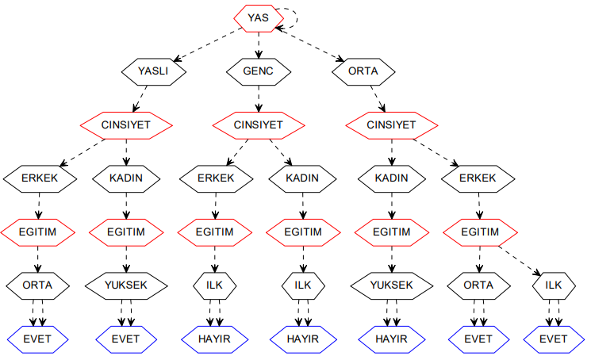

# Entropy

One of the most important preliminary information for data mining activities in social media is that social networks are closely related to big data. In other words, in social networks, there are problems such as the volume of data, velocity of data, variety of data and veracity of data. Data mining techniques include critical methods for large data studies, which can generate a variety of patterns, rules and trends from the data set and enable them to gain important information through these deductions. In general, these processes pass through the stages such as data preprocessing, data analysis and data interpretation.
 
Sosyal medyada veri madenciliği çalışmaları için en önemli ön bilgilerden birisi, sosyal ağların büyük veri (big data) kavramı ile yakından ilişkili olmasıdır. Yani sosyal ağlarda verinin büyüklüğü (volume), verinin değişme hızı (velocity), verinin çeşitliliği(variety) ve verinin doğruluğu (veracity) problemleri bulunmaktadır. Veri madenciliği teknikleri, büyük veri çalışmaları için kritik sonuçlar doğurabilecek ve veri kümesinden çeşitli örüntü, kural ve trendleri çıkarabilecek ve bu çıkarımlar sayesinde önemli bilgilerin kullanım kazanmasını sağlayacak değişik yöntemler içermektedir. Genelde bu işlemler veri ön işlemesi, veri analizi ve veri yorumlaması gibi aşamalardan geçmektedir
 
There are many modeling and expressions used in the scientific analysis of these data in social networks. Machine learning approaches are mostly used for emotion analysis. As machine learning algorithm, Naive Bayes, Shannon Entropy, Decision Trees, Support Vector Machines can be used.
 
Sosyal ağlardaki bu verilerin bilimsel olarak analiz edilmesinde kullanılmış birçok modelleme ve ifade şekli bulunmaktadır. Duygu analizi için çoğunlukla makine öğrenmesi yaklaşımları kullanılmaktadır. Makine öğrenme algoritması olarak Naive Bayes, Shannon Entropi, Karar Ağaçları, Destek Vektör Makineleri gibi yöntemler kullanılabilmektedir.
 
Since the development of these techniques, many different methods have been introduced. These methods undoubtedly constitute the basis of this process. The accuracy, reliability and performance analysis of these methods are as important as finding these methods.

# Facts
-Grapviz
-Desicion Tree
-Entropy
